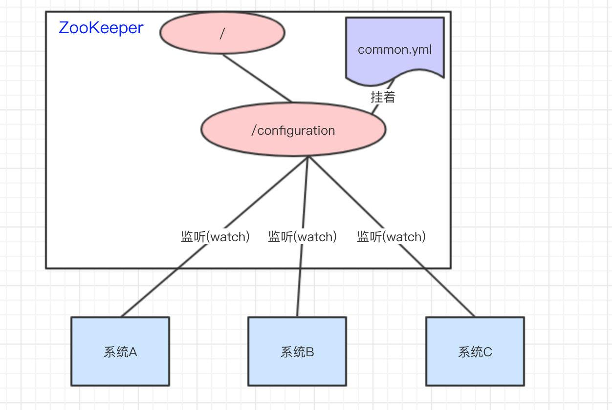
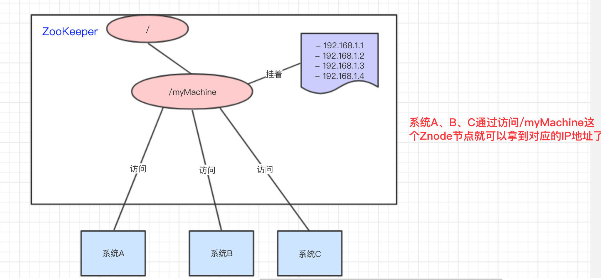
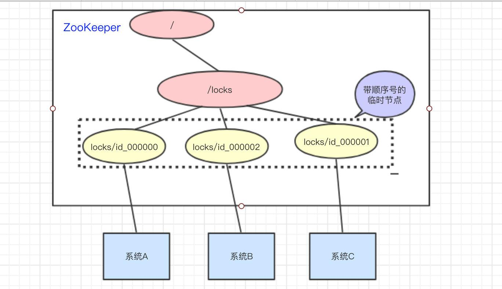
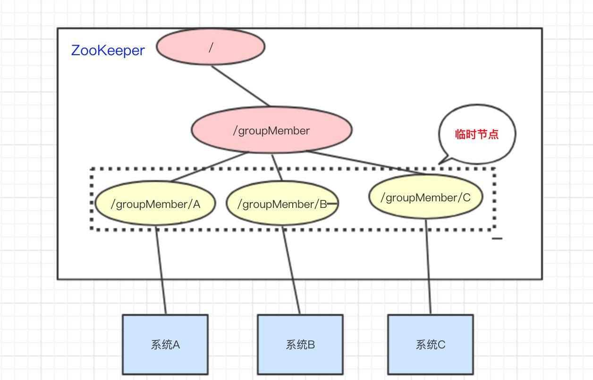

## zookeeper
一种分布式系统的中间件，可以用ZooKeeper来做：统一配置管理、统一命名服务、分布式锁、集群管理。因为分布式系统需要节点管理，所以有zookeeper。

核心：节点，监听。
- Znode节点的数据变化
- 子节点的增减变化

### 统一配置服务
比如我们现在有三个系统A、B、C，他们有三份配置，分别是ASystem.yml、BSystem.yml、CSystem.yml，然后，这三份配置又非常类似，很多的配置项几乎都一样。

此时，如果我们要改变其中一份配置项的信息，很可能其他两份都要改。并且，改变了配置项的信息很可能就要重启系统。

于是，我们希望把ASystem.yml、BSystem.yml、CSystem.yml相同的配置项抽取出来成一份公用的配置common.yml，并且即便common.yml改了，也不需要系统A、B、C重启。

做法：我们可以将common.yml这份配置放在ZooKeeper的Znode节点中，系统A、B、C监听着这个Znode节点有无变更，如果变更了，及时响应。

### 统一命名服务

统一命名服务的理解其实跟域名一样，是我们为这某一部分的资源给它取一个名字，别人通过这个名字就可以拿到对应的资源。

比如说，现在我有一个域名www.java3y.com，但我这个域名下有多台机器：

192.168.1.1

192.168.1.2

192.168.1.3

192.168.1.4

别人访问www.java3y.com即可访问到我的机器，而不是通过IP去访问。

### 分布式锁

- 系统A拿到/locks节点下的所有子节点，经过比较，发现自己(id_000000)，是所有子节点最小的。所以得到锁
- 系统B拿到/locks节点下的所有子节点，经过比较，发现自己(id_000002)，不是所有子节点最小的。所以监听比自己小1的节点id_000001的状态
- 系统C拿到/locks节点下的所有子节点，经过比较，发现自己(id_000001)，不是所有子节点最小的。所以监听比自己小1的节点id_000000的状态

等到系统A执行完操作以后，将自己创建的节点删除(id_000000)。通过监听，系统C发现id_000000节点已经删除了，发现自己已经是最小的节点了，于是顺利拿到锁

### 集群状态

只要系统A挂了，那/groupMember/A这个节点就会删除，通过监听groupMember下的子节点，系统B和C就能够感知到系统A已经挂了。(新增也是同理)

除了能够感知节点的上下线变化，ZooKeeper还可以实现动态选举Master的功能。(如果集群是主从架构模式下)

原理也很简单，如果想要实现动态选举Master的功能，Znode节点的类型是带顺序号的临时节点(EPHEMERAL_SEQUENTIAL)就好了。

Zookeeper会每次选举最小编号的作为Master，如果Master挂了，自然对应的Znode节点就会删除。然后让新的最小编号作为Master，这样就可以实现动态选举的功能了。

## keepalived
Keepalived一个基于VRRP（Virtual Router Redundancy Protocol）协议来实现的 LVS（Linux virtual server） 服务高可用方案，可以利用其来解决单点故障。一个LVS服务会有2台服务器运行Keepalived，一台为主服务器（MASTER），一台为备份服务器（BACKUP），但是对外表现为一个虚拟IP，主服务器会发送特定的消息给备份服务器，当备份服务器收不到这个消息的时候，即主服务器宕机的时候， 备份服务器就会接管虚拟IP，继续提供服务，从而保证了高可用性。

冗余+故障自动发现转移

keepalived工作原理是什么？怎么保证高可用呢？ - 码海的回答 - 知乎
https://www.zhihu.com/question/34822368/answer/2126403039

## Ceph

Ceph是一个统一的**分布式文件存储系统**，设计初衷是提供较好的性能、可靠性和可扩展性。

### 特点

Ceph的特点很多，主要有如下几个方面的特点： 

1. 其摒弃传统的集中式存储元数据寻址的方式，采用CRUSH算法，数据分布均衡，没有单点故障。举个栗子：就像上面的粮仓和粮食的说明，现在张三来存100斤粮食，管理员将其存放在A仓库的B区，然后在小本本记下这个地址，这里的小本本就是元数据。当张三来取粮食的时候，管理员拿出小本本查看粮食的存放位置，然后找到粮食。是不是挺好。但是大家想想，如果这个小本本丢了，会怎么样？ 是不是张三的粮食就找不到了。这样就存在一个重大的隐患。这个隐患的学名叫做单点故障，单点故障的意思是，某一个节点出现故障将会导致集群整个不可用。当然，我们也可以通过用多个小本本同时记录，规避一台元数据服务宕机导致的单点故障。但是，这种方式无疑增加了元数据的维护成本。而Ceph则完全摒弃了元数据寻址的方式，直接通过[CRUSH算法](https://zhuanlan.zhihu.com/p/63725901)的方式来计算文件的位置，使数据可以均衡分布同时也避免了单点故障的问题。 
2.  考虑了容灾域的隔离，能够实现各类负载副本放置规则。同样的还是以粮仓为例子。当一个仓库着火了，我们可以通过隔断门将其与其他正常的仓库隔离。避免影响到其他正常的仓库。 
3.  能够支持上千个存储节点的规模，支持TB和PB级别的数据。这句话的意思就更好理解了，一句话，就是Ceph的能存储的数据特别多，规模也很大。 
4.  扩展灵活，就是说支持动态的增加存储节点。换言之就是可以客户端无感知的情况下增加存储节点。不影响现有的业务。
5.  副本数可以灵活控制，默认情况下Ceph的副本数是3个，我们可以在配置文件中更改副本的数量。

## 虚拟化

