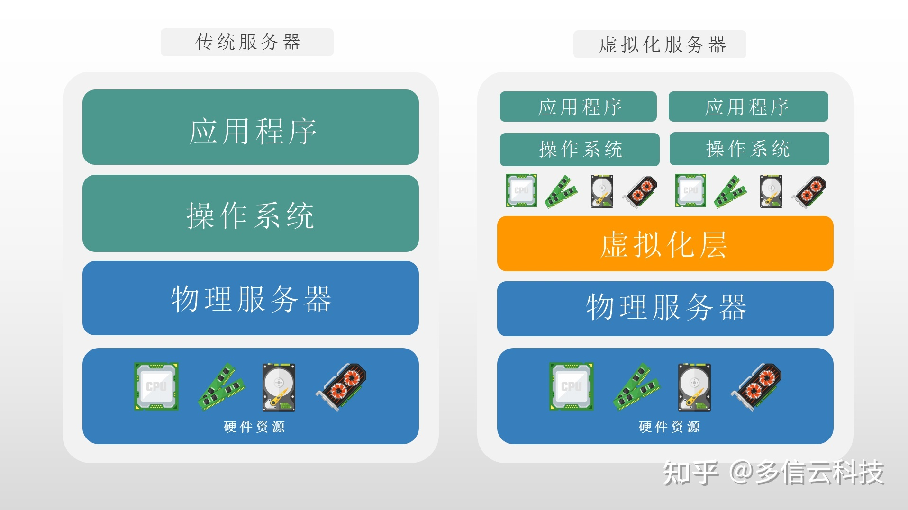
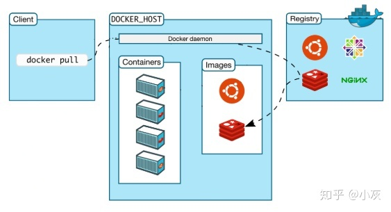
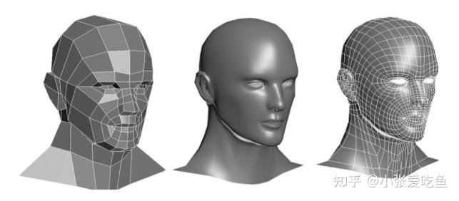
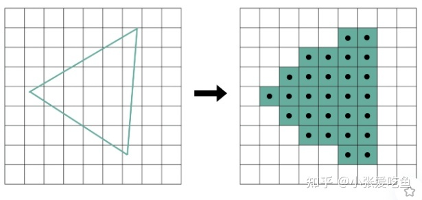
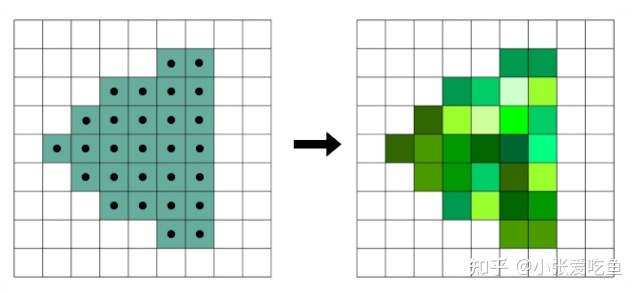
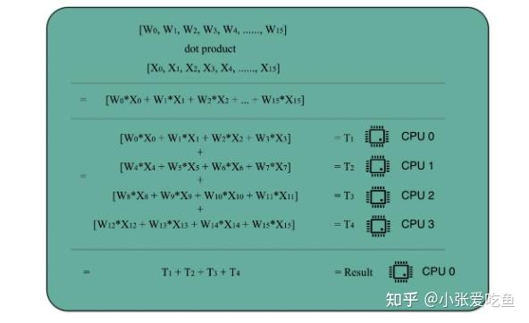
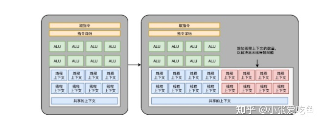
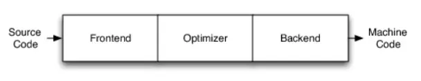
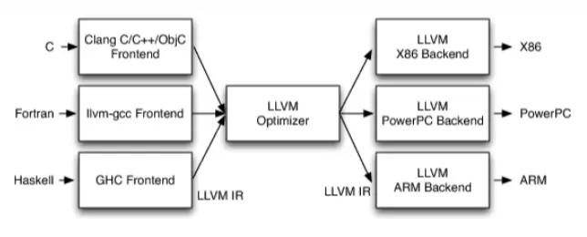
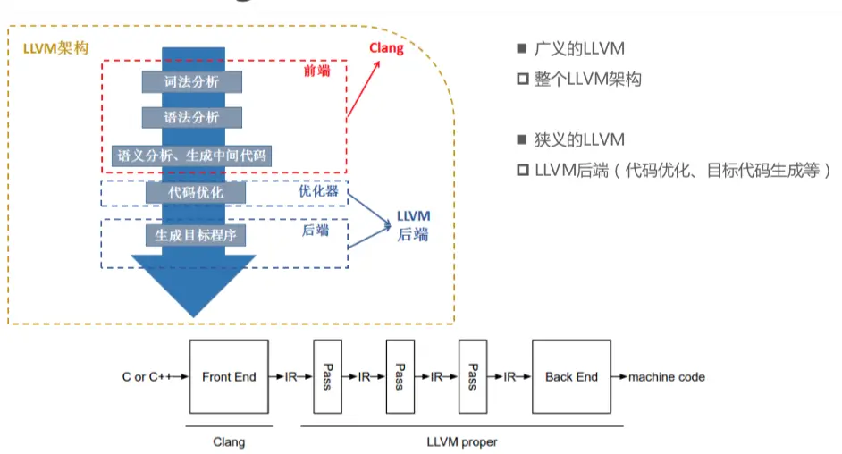

## zookeeper
一种分布式系统的中间件，可以用ZooKeeper来做：统一配置管理、统一命名服务、分布式锁、集群管理。因为分布式系统需要节点管理，所以有zookeeper。

关于中间件：

> 我开了一家炸鸡店（业务端），然而周边有太多屠鸡场（底层），为了成本我肯定想一个个比价，再综合质量挑选一家屠鸡场合作（适配不同底层逻辑）。由于市场变化，合作一段时间后，或许性价比最高的屠鸡场就不是我最开始选的了，我又要重新和另一家屠鸡场合作，进货方式、交易方式等等全都要重来一套（重新适配）。
>
> 然而我只想好好做炸鸡，有性价比高的肉送来就行。于是我找到了一个专门整合屠鸡场资源的第三方代理（中间件），跟他谈好价格和质量后（统一接口），从今天开始，我就只需要给代理钱，然后拿肉就行。代理负责保证肉的质量，至于如何根据实际性价比，选择不同的屠鸡场，那就是代理做的事了。
>
> 总之，中间件类似一个中介，无需关注技术的实现细节，只需要调用。

核心：节点，监听。
- Znode节点的数据变化
- 子节点的增减变化

### 统一配置服务
比如我们现在有三个系统A、B、C，他们有三份配置，分别是ASystem.yml、BSystem.yml、CSystem.yml，然后，这三份配置又非常类似，很多的配置项几乎都一样。

此时，如果我们要改变其中一份配置项的信息，很可能其他两份都要改。并且，改变了配置项的信息很可能就要重启系统。

于是，我们希望把ASystem.yml、BSystem.yml、CSystem.yml相同的配置项抽取出来成一份公用的配置common.yml，并且即便common.yml改了，也不需要系统A、B、C重启。

做法：我们可以将common.yml这份配置放在ZooKeeper的Znode节点中，系统A、B、C监听着这个Znode节点有无变更，如果变更了，及时响应。

### 统一命名服务

统一命名服务的理解其实跟域名一样，是我们为这某一部分的资源给它取一个名字，别人通过这个名字就可以拿到对应的资源。

比如说，现在我有一个域名www.java3y.com，但我这个域名下有多台机器：

192.168.1.1

192.168.1.2

192.168.1.3

192.168.1.4

别人访问www.java3y.com即可访问到我的机器，而不是通过IP去访问。

### 分布式锁

- 系统A拿到/locks节点下的所有子节点，经过比较，发现自己(id_000000)，是所有子节点最小的。所以得到锁
- 系统B拿到/locks节点下的所有子节点，经过比较，发现自己(id_000002)，不是所有子节点最小的。所以监听比自己小1的节点id_000001的状态
- 系统C拿到/locks节点下的所有子节点，经过比较，发现自己(id_000001)，不是所有子节点最小的。所以监听比自己小1的节点id_000000的状态

等到系统A执行完操作以后，将自己创建的节点删除(id_000000)。通过监听，系统C发现id_000000节点已经删除了，发现自己已经是最小的节点了，于是顺利拿到锁

### 集群状态

只要系统A挂了，那/groupMember/A这个节点就会删除，通过监听groupMember下的子节点，系统B和C就能够感知到系统A已经挂了。(新增也是同理)

除了能够感知节点的上下线变化，ZooKeeper还可以实现动态选举Master的功能。(如果集群是主从架构模式下)

原理也很简单，如果想要实现动态选举Master的功能，Znode节点的类型是带顺序号的临时节点(EPHEMERAL_SEQUENTIAL)就好了。

Zookeeper会每次选举最小编号的作为Master，如果Master挂了，自然对应的Znode节点就会删除。然后让新的最小编号作为Master，这样就可以实现动态选举的功能了。

## keepalived
Keepalived一个基于VRRP（Virtual Router Redundancy Protocol）协议来实现的 LVS（Linux virtual server） 服务高可用方案，可以利用其来解决单点故障。一个LVS服务会有2台服务器运行Keepalived，一台为主服务器（MASTER），一台为备份服务器（BACKUP），但是对外表现为一个虚拟IP，主服务器会发送特定的消息给备份服务器，当备份服务器收不到这个消息的时候，即主服务器宕机的时候， 备份服务器就会接管虚拟IP，继续提供服务，从而保证了高可用性。

冗余+故障自动发现转移

keepalived工作原理是什么？怎么保证高可用呢？ - 码海的回答 - 知乎
https://www.zhihu.com/question/34822368/answer/2126403039

## Ceph

Ceph是一个统一的**分布式文件存储系统**，设计初衷是提供较好的性能、可靠性和可扩展性。

### 特点

Ceph的特点很多，主要有如下几个方面的特点： 

1. 其摒弃传统的集中式存储元数据寻址的方式，采用CRUSH算法，数据分布均衡，没有单点故障。举个栗子：就像上面的粮仓和粮食的说明，现在张三来存100斤粮食，管理员将其存放在A仓库的B区，然后在小本本记下这个地址，这里的小本本就是元数据。当张三来取粮食的时候，管理员拿出小本本查看粮食的存放位置，然后找到粮食。是不是挺好。但是大家想想，如果这个小本本丢了，会怎么样？ 是不是张三的粮食就找不到了。这样就存在一个重大的隐患。这个隐患的学名叫做单点故障，单点故障的意思是，某一个节点出现故障将会导致集群整个不可用。当然，我们也可以通过用多个小本本同时记录，规避一台元数据服务宕机导致的单点故障。但是，这种方式无疑增加了元数据的维护成本。而Ceph则完全摒弃了元数据寻址的方式，直接通过[CRUSH算法](https://zhuanlan.zhihu.com/p/63725901)的方式来计算文件的位置，使数据可以均衡分布同时也避免了单点故障的问题。 
2.  考虑了容灾域的隔离，能够实现各类负载副本放置规则。同样的还是以粮仓为例子。当一个仓库着火了，我们可以通过隔断门将其与其他正常的仓库隔离。避免影响到其他正常的仓库。 
3.  能够支持上千个存储节点的规模，支持TB和PB级别的数据。这句话的意思就更好理解了，一句话，就是Ceph的能存储的数据特别多，规模也很大。 
4.  扩展灵活，就是说支持动态的增加存储节点。换言之就是可以客户端无感知的情况下增加存储节点。不影响现有的业务。
5.  副本数可以灵活控制，默认情况下Ceph的副本数是3个，我们可以在配置文件中更改副本的数量。

## 虚拟化

是一种资源管理技术，是将计算机的各种实体资源（CPU、内存、磁盘空间、网络适配器等），予以抽象、转换后呈现出来并可供分割、组合为一个或多个电脑配置环境。由此，打破实体结构间的不可切割的障碍，使用户可以比原本的配置更好的方式来应用这些电脑硬件资源。这些资源的新虚拟部分是不受现有资源的架设方式，地域或物理配置所限制。一般所指的虚拟化资源包括计算能力和资料存储。

早期服务器只能运行特定的操作系统和程序，其他的不兼容。公司为了运行新业务，只能不断购买新的服务器，一方面，成本越来越高，运维麻烦；另一方面，算力资源大量浪费。这正是20年多前企业数据中心的普遍现状。

什么是虚拟化？我们举一个通俗的例子。假设你有3台服务器，每1台固定跑1个业务。这个时候，每台服务器使用了30%的算力，剩余的70%处于闲置状态。

虚拟化是如何解决问题的？我们来看一下这张图，服务器的底层是硬件，包括CPU、GPU、IO（输入输出设备）、内存、磁盘和网卡等，统称为“硬件资源”，往上是操作系统和程序。虚拟化技术相当于在硬件和操作系统之间，增加了一个虚拟化平台，屏蔽了硬件和操作系统之间的兼容性问题。这个时候，不管硬件是否兼容，我们都能安装多个操作系统，每个系统运行不同的业务。底层硬件变成一个共享“资源池”，每个操作系统需要多大的CPU、内存、硬盘，由虚拟化平台按需分配。运行在虚拟化平台上的操作系统，我们叫它虚拟机。

原本单台服务器只能发挥30%的性能，现在1台服务器可以运行多个操作系统，服务器性能可以发挥到60%，甚至90%。假设以前需要100台服务器，现在可能只需要30多台，硬件成本大幅度降低，而且机房的电费、散热和维护等成本也随之降低。

简单来说，虚拟化允许在一台服务器上同时运行多个操作系统，能够提升资源使用效率。

虚拟化是云计算的基础：

- 提高资源利用率：虚拟化技术可以将一台物理服务器划分为多个虚拟机，每个虚拟机拥有独立的操作系统和应用程序，可以在不同的虚拟机之间**灵活地分配计算资源**，从而提高了物理服务器的资源利用率。

- 实现快速部署和弹性伸缩：通过虚拟化技术，可以快速创建和销毁虚拟机，实现应用程序的**快速部署和弹性伸缩**。例如，当应用程序需要更多计算资源时，可以通过自动化的方式快速创建新的虚拟机，并将应用程序部署到新的虚拟机上。

- 提高安全性：虚拟化技术可以将不同的虚拟机隔离开来，每个虚拟机拥有独立的操作系统和应用程序，可以提高**安全性**，避免应用程序之间的相互干扰和攻击。

- 简化管理和维护：通过虚拟化技术，可以将虚拟机的管理和维护与物理服务器分离，简化了管理和维护的工作量。例如，可以通过自动化的方式对虚拟机进行管理、备份和恢复操作，**提高了运维效率**。

- 支持多租户：虚拟化技术可以将一台物理服务器划分为多个虚拟机，每个虚拟机拥有独立的操作系统和应用程序，可以为不同的租户提供独立的计算资源。这样可以实现多租户的支持，提高了云计算平台的**灵活性和可扩展性**。

虚拟化分为硬件虚拟化和容器技术。

### 硬件虚拟化

虚拟机，就是用的硬件虚拟化技术。每个虚拟机需要一个完整的操作系统，才能装应用。但是，如果每次发布应用，都得搞一个完整操作系统和附带的依赖环境，会很繁琐。

虚拟机需要虚拟硬件，然后再装操作系统和应用。

强调安全、隐私性。

### 容器

容器是用来装东西的地方，就像书包可以装文具、衣柜可以放衣服一样。我们现在说的容器，里面存放的是应用程序，以及程序运行所依赖的系统环境。通过容器技术，我们可以把应用和依赖的环境打包，打包之后移植到另一个主机上，还能正常运行。

容器直接使用原来的操作系统，只需要打包应用和依赖的环境即可，应用共享相同的操作系统。因此，容器更加轻量化，容易迁移、部署方便、启动速度更快、资源占用也更小。而且，容器可以实现标准化，就像集装箱，能按统一的规范来做。

如果一个应用在不同操作系统上不兼容，使用容器如何实现？

> 容器确实包含应用程序所需的操作系统组件，但这些组件并不一定包括完整的操作系统，而是针对特定的操作系统版本和发行版进行优化，以满足应用程序的运行环境和依赖项。
>
> 当容器共享主机操作系统时，容器中的应用程序和操作系统组件将与主机操作系统的内核和其他系统资源共享，这使得容器具有更高的资源利用率和灵活性。但同时，这也意味着容器中的应用程序和操作系统组件需要与主机操作系统相兼容，以避免在容器中运行时出现问题。
>
> 例如，如果容器运行在 Linux 主机上，那么容器中的应用程序和操作系统组件需要兼容 Linux 内核和其他系统组件。如果容器运行在 Windows 主机上，那么容器中的应用程序和操作系统组件需要兼容 Windows 内核和其他系统组件。如果容器中的应用程序和操作系统组件与主机操作系统不兼容，可能会导致应用程序无法启动或运行异常。
>
> 此外，即使容器中的应用程序和操作系统组件在不同操作系统上都兼容，也不能保证应用程序在不同操作系统上的行为完全相同。因为不同操作系统之间可能存在差异，例如文件系统布局、网络配置、系统调用等等，这些差异可能会影响应用程序的行为。因此，在将应用程序从一个操作系统迁移到另一个操作系统时，还需要进行适当的测试和验证，以确保应用程序在新的操作系统中能够正常工作。
>
> 总的来说，容器共享主机操作系统的特性可能会导致容器中的应用程序在不同操作系统上运行不兼容，这需要在容器设计和部署时进行适当的考虑和测试，以确保应用程序能够正常运行。容器中的操作系统组件可以帮助应用程序在共享主机操作系统的同时提供所需的环境和依赖项，但同时也需要与主机操作系统相兼容，以避免出现问题。

强调轻量级，迅速。

## Docker

一种容器技术，无需像虚拟机那样加载全部的操作系统。容器是一种通用技术，docker只是其中的一种实现。

docker是一个用Go语言实现的开源项目，可以让我们方便的创建和使用容器，docker将程序以及程序所有的依赖都打包到docker container，这样你的程序可以在任何环境都会有一致的表现，这里程序运行的依赖也就是容器就好比集装箱，容器所处的操作系统环境就好比货船或港口，**程序的表现只和集装箱有关系(容器)，和集装箱放在哪个货船或者哪个港口(操作系统)没有关系**。

因此我们可以看到docker可以屏蔽环境差异，也就是说，只要你的程序打包到了docker中，那么无论运行在什么环境下程序的行为都是一致的，程序员再也无法施展表演才华了，**不会再有“在我的环境上可以运行”**，真正实现“build once, run everywhere”。

此外docker的另一个好处就是**快速部署**，这是当前互联网公司最常见的一个应用场景，一个原因在于容器启动速度非常快，另一个原因在于只要确保一个容器中的程序正确运行，那么你就能确信无论在生产环境部署多少都能正确运行。

docker中有这样几个概念：

- dockerfile
- image
- container

实际上可以简单的把image理解为可执行程序，container就是运行起来的进程。

那么写程序需要源代码，那么“写”image就需要dockerfile，dockerfile就是image的源代码，docker就是"编译器"。

因此我们只需要在dockerfile中指定需要哪些程序、依赖什么样的配置，之后把dockerfile交给“编译器”docker进行“编译”，也就是docker build命令，生成的可执行程序就是image，之后就可以运行这个image了，这就是docker run命令，image运行起来后就是docker container。

docker的常用命令：

- docker build

  当我们写完dockerfile交给docker“编译”时使用这个命令，那么client在接收到请求后转发给docker daemon，接着docker daemon根据dockerfile创建出“可执行程序”image。

  

- docker run

  有了“可执行程序”image后就可以运行程序了，接下来使用命令docker run，docker daemon接收到该命令后找到具体的image，然后加载到内存开始执行，image执行起来就是所谓的container。

  

- docker pull

  我们之前说过，docker中image的概念就类似于“可执行程序”，我们可以从哪里下载到别人写好的应用程序呢？很简单，那就是APP Store，即应用商店。与之类似，既然image也是一种“可执行程序”，那么有没有"Docker Image Store"呢？答案是肯定的，这就是Docker Hub，docker官方的“应用商店”，你可以在这里下载到别人编写好的image，这样你就不用自己编写dockerfile了。

  docker registry 可以用来存放各种image，公共的可以供任何人下载image的仓库就是docker Hub。那么该怎么从Docker Hub中下载image呢，就是这里的docker pull命令了。

  因此，这个命令的实现也很简单，那就是用户通过docker client发送命令，docker daemon接收到命令后向docker registry发送image下载请求，下载后存放在本地，这样我们就可以使用image了。

  

## MPSoc

Multi-Processor System on Chip，多处理器片上系统。它是一种在单个芯片上集成多个处理器核心、内存、输入/输出接口、加速器和其他组件的系统。

出现原因：利用更深的流水线和更激进的宽问题超标量技术来利用大量的指令级并行，并将大部分晶体管预算用于大型片上高速缓存已经走到了死胡同。特别是，由于散热问题和过高的能耗，随着时钟频率的提高，扩展性能变得越来越困难。只有在所有系统级别上利用并行性才能提高性能。因此引入多核系统，在单个芯片上集成多个内核可以在不增加时钟频率的情况下显著提高性能。

从SoC(单个芯片充当master控制总体)->NoC(共享通信模块)->MPSoC(多个芯片充当master控制总体)。

They combine several embedded processors, memories and specialized circuitry (accelerators, I/Os) interconnected through a dedicated infrastructure to provide a complete integrated system. 

MPSoC的简单模型如下：

通常用于高性能和低功耗的嵌入式系统。

## FPGA

Field（现场） Programmable（可编程） Gate（逻辑门） Array（阵列）。可以把FPGA当做是数字世界的乐高，它由几种最基本的单元（每种单元数量有很多很多）让你组成自己想实现的功能。是一个可以通过编程来改变内部结构的芯片。是作为专用集成电路（ASIC）领域中的一种半定制电路而出现的，既解决了定制电路的不足，又克服了原有可编程器件门电路数有限的缺点。

在FPGA的结构中若要实现“Y=A&B&C”的逻辑功能，用户首先在EDA工具中使用硬件描述语言设计出“Y=A&B&C”逻辑代码，EDA工具（QUARTUS或其他开发工具）分析这一行代码，得出A、B、C在不同输入组合下（共8种），Y的值分别是多少。然后软件工具将所有的结果写到查找表（LUT）上，从而实现了该代码的功能。查找表就类似于一个RAM，输入A、B、C则相当于地址，通过A、B、C的地址就得读到值赋给Y并输出。

使用LUT代替传统的逻辑门实现组合逻辑的优点：

1. 通过LUT代替组合逻辑，而LUT中的值只和输入有关，因此组合逻辑的功能由输入决定，不再和复杂度有关；
2. LUT实现的组合逻辑的延迟是固定的。

## GPU

拥有大量内核，可进行并行计算。面对的是类型高度统一的、相互无依赖的大规模数据和不需要被打断的纯净的计算环境。

应用领域：图形处理、并行计算。

显卡性能指标：

- **显存**：也就是显卡内存，GDDR6表示第六代显存，代数越高一般来说性能也会越好
- **CUDA核心数**：就是GPU的同时运算的单元，这个数值也越高越好
- **位宽**：GPU显存提取数据一次性能提取的位数
- **带宽**：也就是GPU和显存之间的传输速率，以RTX3050的带宽就为88GB/s

### 图像处理工作原理

- 顶点处理

  画面是三维的，而我们的电脑屏幕只能显示二维的东西，要让三维的画面看起来具有立体感，就需要通过线性代数的计算，如果建模越精细，画面看起来的像素颗粒感越少，就需要越多的顶点，这个把三维坐标系里的坐标转化为二维坐标的过程，就叫顶点处理。

  而这个顶点位置的转化，互相之间没有依赖，是可以进行并行计算的。

  

- 图元处理

  顶点处理完成之后，图元处理的操作其实就是把各个顶点连接起来，变化为多边形，其实转换后的顶点仍然处于一个三维空间里，只是第三维的Z轴变成了屏幕的“深度”，所以我们需要针对多边形进行剔除和裁剪不在屏幕中的部分，减少接下来的工作了。

- 栅格化

  图元处理完之后，渲染还没有完成，屏幕的分辨率是有限的，所以需要通过一个个的像素显示出来。

  

- 片段处理

  在栅格化成像素点之后，图像实际上还是“黑白”的，我们还需要计算每一个像素的颜色透明度等信息，给像素上色。
  
  
  
- 像素操作
  
  最后一步是将多个不同的多边形像素点“混合”在一起，可能有些多边形是半透明的，那么混合在一起之后就会产生一个新的颜色；或则前面的多边形挡住后面了，就直接显示前面的多边形就好了。最终显示在显示设备上。
  
### 并行计算的工作原理

  参考CPU多核计算的原理，GPU也是相同的，比如向量 W=[W0,W1,W2,…,W15] 和向量 X=[X0,X1,X2,…,X15]的乘积，W⋅X=W0∗X0+W1∗X1+ W2∗X2+…+W15∗X15。

这些式子由 16 个乘法和 1 个连加组成。

如果你自己一个人用笔来算的话，需要一步一步算 16 次乘法和 15 次加法。如果这个时候我们把这个任务分配给 4 个人，同时去算 W0～W3, W4～W7, W8～W11, W12～W15 这样四个部分的结果，再由一个人进行汇总，需要的时间就会缩短，如下图

为了进一步提升单核的运算速度，一个GPU核实际上只有核心部分**算数逻辑单元**（ALU）在进行并行计算，所以在取指令和指令译码之后，可以分配给多个不同的ALU进行并行运算，GPU的运行当然是具有很多不同指令的切换，因此还需要很多个线程上下文

## NPU

NPU（Neural Processing Unit）是一种专门用于加速神经网络计算的处理器。与通用的CPU（Central Processing Unit）和GPU（Graphics Processing Unit）相比，NPU可以提供更高的计算性能、更低的功耗和更高的效率，特别是在处理大规模的深度神经网络时。

NPU通常被设计为高度定制化的处理器，可以针对特定的神经网络架构进行优化。它们通常包括大量的基于矩阵计算的算术单元（ALU）和存储器，以实现高效的神经网络计算。此外，NPU还可以支持各种神经网络层的加速，如卷积层、全连接层、池化层等。

NPU的应用场景主要是人工智能和深度学习领域。由于深度神经网络通常需要进行大量的计算和数据处理，NPU可以提供更高的计算性能和更快的运行速度，从而加快模型训练和推理的速度。NPU可以用于各种应用场景，如图像识别、语音识别、自然语言处理、智能驾驶、工业自动化等。

从技术角度看，深度学习实际上是一类多层大规模人工神经网络。它模仿生物神经网络而构建，由若干人工神经元结点互联而成。神经元之间通过突触两两连接，突触记录了神经元间联系的权值强弱。由于深度学习的基本操作是神经元和突触的处理，神经网络中存储和处理是一体化的，都是通过突触权重来体现，而冯·诺伊曼结构中，存储和处理是分离的，分别由存储器和运算器来实现，二者之间存在巨大的差异。当用现有的基于冯·诺伊曼结构的经典计算机(如X86处理器和英伟达GPU)运行神经网络应用时，就不可避免地受到存储和处理分离式结构的制约，因而影响效率。因此，专门针对人工智能的专业芯片NPU更有研发的必要和需求。

相较于CPU擅长处理任务和发号施令，GPU擅长进行图像处理、并行计算，NPU更擅长处理人工智能任务。NPU在电路层模拟人类神经元和突触，并且用深度学习指令集直接处理大规模的神经元和突触，一条指令完成一组神经元的处理。相比于CPU和GPU的冯诺伊曼结构，NPU通过突触权重实现存储和计算一体化，从而提高运行效率。但NPU也有不足，比如目前它并不支持对大量样本的训练，相对来说更擅长预测和推理。

## TVM

全称是Tensor Virtual Machine。TVM 是一种深度学习编译器和运行时系统，可以将深度学习模型编译成适用于各种硬件平台的可执行代码。它的目的是使深度学习应用能够高效地运行在各种硬件平台上，提高应用的性能和效率。

在传统的深度学习应用中，模型的训练和推理通常是在相同的硬件平台上进行的。但是，随着各种新型硬件平台的出现，如GPU、FPGA、ASIC等，这种做法可能会导致性能瓶颈和资源浪费。而 TVM 的编译器和运行时系统可以将模型优化为适用于特定硬件平台的代码，从而提高应用的效率和性能。

TVM 的编译器将深度学习模型转换为中间表示（IR），并对其进行各种优化，如算子融合、内存优化、并行化等。然后，它将 IR 编译为适用于特定硬件平台的代码，如GPU、FPGA、CPU等。这使得开发者可以根据应用的需求选择最适合的硬件平台，并获得更高的性能和效率。

TVM 的运行时系统负责将优化后的代码在硬件平台上执行，并处理各种运行时问题，如内存管理、并发控制、错误处理等。它还提供了一系列的接口，使得开发者可以更加方便地将深度学习模型集成到应用中。

总的来说，TVM 是一种深度学习编译器和运行时系统，可以将深度学习模型编译为适用于各种硬件平台的可执行代码。它的目的是提高深度学习应用的效率和性能，使开发者可以更加方便地在各种硬件平台上部署和运行应用。

由于硬件的内存组织与计算能力存在着显著的差异。考虑到这种需求的复杂性，开发一种能够将深度学习高级程序降低为适应任何硬件后端的低级优化代码的优化框架是最好的方法。

[陈天奇等人提出TVM：深度学习自动优化代码生成器-36氪 (36kr.com)](https://www.36kr.com/p/1722284703745#:~:text=TVM 是由华盛顿大学在读博士陈天奇等人提出的深度学习自动代码生成方法，去年 8 月 机器之心曾对其进行过简要介绍 。. 该技术能自动为大多数计算硬件生成可部署优化代码，其性能可与当前最优的供应商提供的优化计算库相比，且可以适应新型专用加速器后端。. 近日，这项研究的论文《TVM%3A,TVM 在英伟达、AMD 的 GPU、树莓派及一些 FPGA 上的性能评估。. （项目链接：https%3A%2F%2Fgithub.com%2Fdmlc%2Ftvm）. 深度学习模型可以识别图像、处理自然语言，以及在部分具有挑战性的策略游戏中击败人类。.)

*论文：[TVM: End-to-End Optimization Stack for Deep Learning](https://arxiv.org/abs/1802.04799)*

## LLVM

LLVM 的全称是 "Low Level Virtual Machine"，中文翻译为 "低级虚拟机"。虽然名字中包含 "Virtual Machine"，但 LLVM 不是一个传统意义上的虚拟机，而是一个编译器基础设施，用于构建各种编译器、工具和库。LLVM项目是模块化、可重用的编译器以及工具链技术的集合。可以说llvm是一种框架。

传统编译器架构如下：

- **Frontend:前端**
  词法分析、语法分析、语义分析、生成中间代码
- **Optimizer:优化器**
  中间代码优化
- **Backend:后端**
  生成机器码

llvm架构如下：

- 不同的前端后端使用统一的中间代码LLVM Intermediate Representation (LLVM IR，即llvm中间表示)
- 如果需要支持一种新的编程语言，那么只需要实现一个新的前端
- 如果需要支持一种新的硬件设备，那么只需要实现一个新的后端
- 优化阶段是一个通用的阶段，它针对的是统一的LLVM IR，不论是支持新的编程语言，还是支持新的硬件设备，都不需要对优化阶段做修改
- 相比之下，GCC的前端和后端没分得太开，前端后端耦合在了一起。所以GCC为了支持一门新的语言，或者为了支持一个新的目标平台，就变得特别困难
- LLVM现在被作为实现各种静态和运行时编译语言的通用基础结构(GCC家族、Java、.NET、Python、Ruby、Scheme、Haskell、D等)

**也就是说，我可以把它总结为，llvm消除了传统编译器架构的耦合，使编译器变得更加灵活。而它IR和中间Optimal的部分，有一点虚拟机“BORE”的特性，所以命名之初叫llvm**

以Clang为例：

> Clang是LLVM项目的一个子项目，基于LLVM架构的C/C++/Objective-C编译器前端。
>
> **相比于GCC，Clang具有如下优点**
>
> - 编译速度快:在某些平台上，Clang的编译速度显著的快过GCC(Debug模式下编译OC速度比GGC快3倍)
> - 占用内存小:Clang生成的AST所占用的内存是GCC的五分之一左右
> - 模块化设计:Clang采用基于库的模块化设计，易于 IDE 集成及其他用途的重用
> - 诊断信息可读性强:在编译过程中，Clang 创建并保留了大量详细的元数据 (metadata)，有利于调试和错误报告
> - 设计清晰简单，容易理解，易于扩展增强

参考：[深入浅出让你理解什么是LLVM - 简书 (jianshu.com)](https://www.jianshu.com/p/1367dad95445)

## MLIR

一篇可能还不错的文章：[编译器与中间表示: LLVM IR, SPIR-V, 以及 MLIR | Lei.Chat()](https://www.lei.chat/zh/posts/compilers-and-irs-llvm-ir-spirv-and-mlir/#fnref:2)

## NAS

## XXL_job
